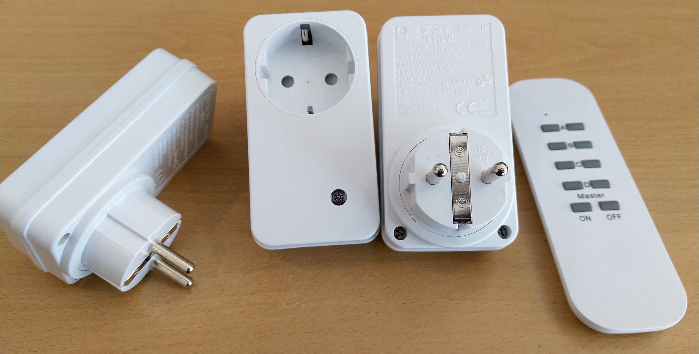

# Espurna-SF501-RF-Plugin
The purpose of this plugin is to add support for low-cost 1000w remote controlled relays commonly sold at *Action Nederland* to the Espurna Firmware for ESP8266 via a low cost 433 MHZ RF module.
Do note that these relays are stateless, therefore they cannot report their state back to a reciever. 




## Install instructions (For PlatformIO)
`Note: this is tested on PlatformIO, I'm not entirely sure how to do this in Arduino`
* You need a single 433 RF transmitter with it's data pin attached to the ESP (Lets use pin 5 for these instructions)
* To be able to use this plugin, you need to install [this library](https://github.com/arjhun/arduino-sf501remote) to `{Espurna Project folder}/code/lib`
  * This library handles the remote commands via RF
* Add the folder `sf501` to `./code/lib`
  * This contains the header file for this plugin
* Add `sf501.ino` to `./code/espurna`
  * This is the main code
* Add `custom.h` to `./code/espurna/config`
  * This tells espurna to load this plugin
* You need to add a few Dummy Relays to add easy switches to the web GUI
  * In `./code/espurna/config/hardware.h` add this under your board defenitions
    ```
    #define RELAY%_PIN          #PIN#
    #define RELAY%_TYPE         RELAY_TYPE_NORMAL
    ```
  * Replace `#PIN#` with the pin you plan on *Not* Needing (EG pin`8`)
  * Replace `%` with the ID of the relay
  * You can add more relays by repeating those two lines and setting the ID to one higher, like this
  ```
    // Normal Relays
    #define RELAY1_PIN          12
    #define RELAY1_TYPE         RELAY_TYPE_NORMAL

    // 7 Dummy Relays (To control remote relays)
    #define RELAY2_PIN          15
    #define RELAY2_TYPE         RELAY_TYPE_NORMAL
    #define RELAY3_PIN          15
    #define RELAY3_TYPE         RELAY_TYPE_NORMAL
    #define RELAY4_PIN          15
    #define RELAY4_TYPE         RELAY_TYPE_NORMAL
    #define RELAY5_PIN          15
    #define RELAY5_TYPE         RELAY_TYPE_NORMAL
    #define RELAY6_PIN          15
    #define RELAY6_TYPE         RELAY_TYPE_NORMAL
    #define RELAY7_PIN          15
    #define RELAY7_TYPE         RELAY_TYPE_NORMAL
    #define RELAY8_PIN          15
    #define RELAY8_TYPE         RELAY_TYPE_NORMAL
    ```
  * You also might want to add some extra settings like this:
  ```
    #define RF_REMOTE_ID        12345   // This tells the plugin which remote id it's emulating (change to any chosen number)
    #define RF_OUTPUT_PIN       5       // This is the pin that controls the RF transmitter
    #define RF_RELAY_START      1       // Select which BASE relay ID (-1*) will control the remote relays
    #define RF_MAX_RELAYS       7       // Set the maximum amount of relays to read (-1*)
  ```
* To be able to load the plugin add this argument to your `build_flags` in `./code/platformio.ini` 
  * `-DUSE_CUSTOM_H` 

## Pairing instructions
#### To pair relays
* Open the web interface
* Make sure the desired Switch # is set to `OFF` (Set to `ON` if you want to unpair)
* Plug in the relay (This will start it up into pair mode)
* Turn the switch to `ON` on the GUI (Set to `OFF` if you want to unpair)


  
